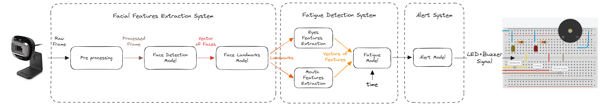

# PFE_Mecatronica_Guarise_Trubiano
Repositorio para almacenar el código del PFE de la carrera de Ingeniería en Mecatrónica, FING, UNCuyo. Desarrollado por Renzo Guarise y Lucas Trubiano.

El proyecto consiste en el desarrollo de un sistema de reconocimiento facial para detectar cansancio o distracciones en la conducción.


## Arquitectura del proyecto

El proyecto se divide en 3 subsistemas que se ejecutan en cascada. Los mismos son:
1. **FacialFeaturesExtractionSystem (FFES)**: es el encargado de hacer un preprocesamiento de la imagen y detectar la cara del conductor junto con sus rasgos faciales (ojos y boca) y puntos de referencia.
2. **Fatigue Detection System (FDS)**: es el encargado de detectar si el conductor se encuentra cansado o distraído. Para ello, se analizan los puntos de referencia de la cara y las features extraídas en el paso anterior.
3. **Alert System (AS)**: en base a los resultados obtenidos en el paso anterior, se crea un modelo de cuando emitir una alerta en función del tiempo y periodicidad de los eventos registrados por el modelo anterior.

<!-- Agregar imagen docs/arquitectura.png -->
[](docs/arquitectura.png)

## Estructura del repositorio

```bash
.
├── images
│   ├── raw (original images)
│   │   ├── neg
│   │   └── pos
│   ├── processed (generated by process_images.py that crops and resizes images)
│   │   └── xx_yy (where xx is the width and yy is the height)
│   │       ├── neg
│   │       └── pos
│   └── real_time (images captured by the camera)
│       ├── neg
│       └── pos
├── models
│   ├── haarcascade_face_default.xml
│   ├── haarcascade_eye_default.xml
│   └── haarcascade_mouth_default.xml
├── src
│   ├── train.py
│   ├── test.py
│   ├── validate.py
│   ├── process_images.py
│   ├── real_time.py
│   └── utils.py
├── docs (imagenes, informes, etc.)
├── .env
├── .gitignore
├── main.py
├── README.md
└── requirements.txt
```


## Create virtual environment

```bash
python -m venv venv
source venv/bin/activate
```

## Install dependencies

```bash
python -m pip install -r requirements.txt
```

## Configure Linux to train model

```bash
# Update and upgrade
sudo apt-get update
sudo apt-get upgrade

# Install git
sudo apt-get install git

# Create directory
cd /mnt/c/Users/lucas/Documents/GitHub/PFE_Mecatronica_Guarise_Trubiano/
mkdir training_haar_cascade
cd training_haar_cascade

# Clone repository
git clone https://github.com/opencv/opencv.git

# Install dependencies
# Compiler:
sudo apt-get install build-essential

# Libraries:
sudo apt-get install cmake git libgtk2.0-dev pkg-config libavcodec-dev libavformat-dev libswscale-dev

# Python:
# sudo apt-get install python-dev python-numpy libtbb2 libtbb-dev libjpeg-dev libpng-dev libtiff-dev libjasper-dev libdc1394-22-dev
sudo apt-get install libtbb2 libtbb-dev libjpeg-dev libpng-dev libtiff-dev

# OpenCV:
sudo apt-get install libopencv-dev
```


Train the model

```bash
opencv_traincascade -data data -vec positives.vec -bg bg.txt -numPos 1800 -numNeg 900 -numStages 10 -w 20 -h 20
```
